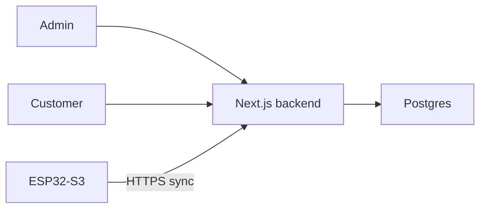

# Architecture

## Decision: one modular Next.js application

Customer, admin, and device APIs share server-side domain services and one Postgres database. Marketing stays in the same app. Firmware remains independently built and deployed.

`app/` owns routing and composition. `modules/` owns permissions, validation, and domain behavior. Database functions own operations that must be atomic. Shared components own presentation, never financial authority.

## Trust boundaries

Browser sessions are authenticated and time-limited. Customer and admin sessions have separate audiences. Every API checks its role and resource ownership; hiding navigation is not authorization. Privileged database credentials are server-only. Browser requests cannot nominate another user's account.

Devices use a separate random credential stored hashed on the server. Pairing codes establish ownership, not authentication. A customer browser never receives the hardware secret. A revoked device cannot sync.

## Three independent states

Published state: operator-authored display content, version and publication timestamp.
Reported state: heartbeat, uptime, firmware version, and applied publication version.
Financial state: append-only ledger, online-device daily rewards and outstanding withdrawal reservations. Device heartbeats accumulate eligible online seconds in PostgreSQL; completing a 24-hour cycle writes the reward and audit event atomically.

The dashboard and device read the same publication. A display value never implicitly becomes an account credit. Connectivity is computed from the latest heartbeat, not an operator-controlled online flag.

## Client state

Persist language/theme only. Fetch authenticated data from the server with visible loading, empty, stale, and error states. Clear account data on sign-out. Never fall back to demo rows or fabricated money.

## Growth

Begin with HTTPS polling and bounded payloads. A separate device gateway or MQTT broker can be introduced when measured fleet size requires it; versioned contracts keep that change independent of screen rendering.
